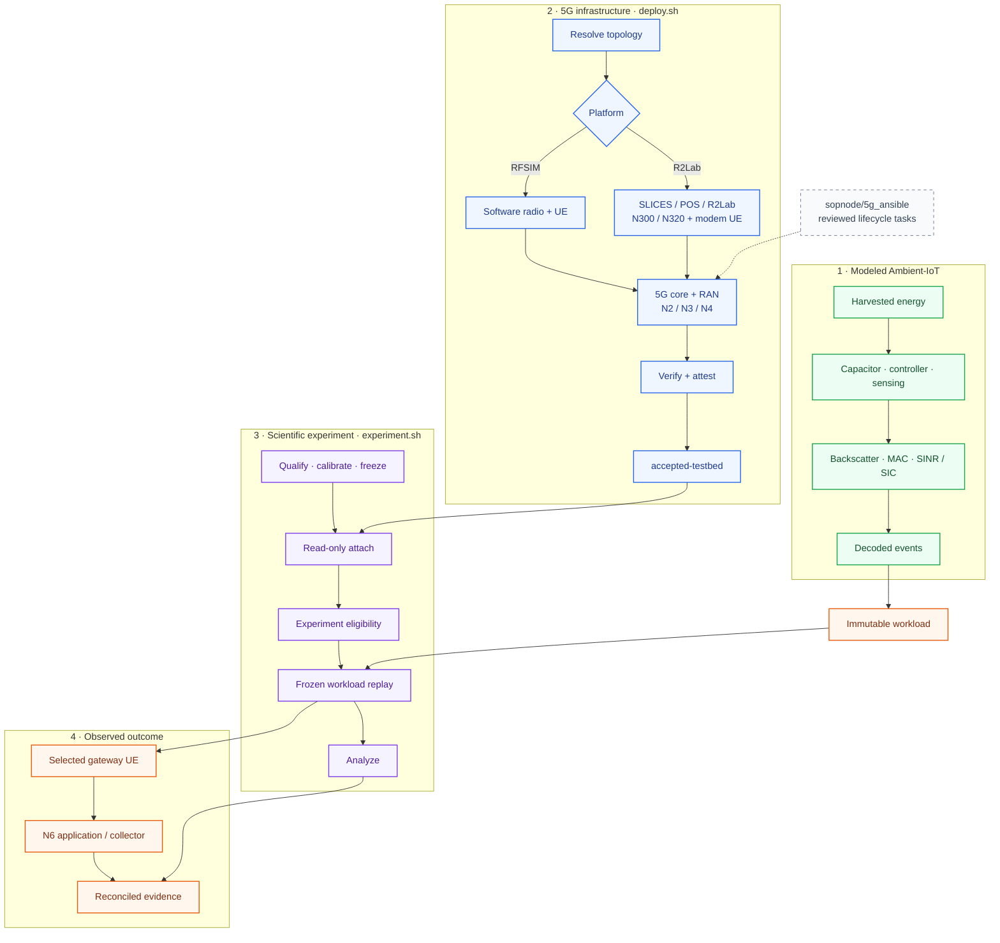

<div align="center">

# SynthRAN

**Ambient-IoT modelling and reproducible 5G experimentation across virtual and physical testbeds.**

<p>
  <a href="https://github.com/nayreed/SynthRAN/blob/main/pyproject.toml"></a>
  <a href="https://github.com/nayreed/SynthRAN/blob/main/pyproject.toml"></a>
  <a href="https://github.com/nayreed/SynthRAN/actions/workflows/ci.yml"></a>
  <a href="https://github.com/nayreed/SynthRAN/commits/main"></a>
  <a href="https://github.com/nayreed/SynthRAN/blob/main/LICENSE"></a>
</p>

</div>

SynthRAN is a research-software platform for studying how an **energy-constrained Ambient-IoT source process** becomes an **observable application-level outcome across a programmable 5G network**.

The project keeps two responsibilities deliberately separate:

- **`deploy.sh` owns infrastructure** — reservation, provisioning, core/RAN/radio deployment, UE preparation, verification, attestation, and accepted deployment state.
- **`experiment.sh` owns science** — experiment selection, qualification, calibration, frozen designs, confirmation campaigns, analysis, and retained scientific evidence.

That boundary is a research invariant: an experiment must not silently repair or reconfigure the testbed in order to make a result pass.

> **Claim boundary:** Ambient-IoT harvesting, capacitor behavior, backscatter access, collision, and decoding are modeled. When a physical N300/N320 path is used, it carries the **5G gateway transport** for a frozen decoded workload; it does not turn the upstream Ambient-IoT radio link into a physical implementation.

---

## System model



**How to read it:**

- **The Ambient-IoT radio process is modeled.** Physical R2Lab hardware carries the downstream 5G gateway transport of a frozen decoded workload; it does not make the upstream Ambient-IoT link physical.
- **`deploy.sh` owns infrastructure; `experiment.sh` owns science.** Reviewed `sopnode/5g_ansible` tasks may implement lifecycle steps, but SynthRAN retains resource authority, deployment identity, and acceptance.
- **`accepted-testbed` is necessary but not sufficient for a physical study.** Experiments apply a separate eligibility gate for the fresh UE/PDU/path/treatment evidence required by that study before replay begins.

---

## Public interfaces

### Deploy infrastructure

```bash
./deploy.sh
```

`deploy.sh` owns infrastructure state. It resolves and reserves resources, prepares hosts, deploys supported core/RAN/radio/UE combinations, verifies the live system, and publishes an accepted deployment identity.

```bash
./deploy.sh --help
```

A caller-supplied deployment file may be used with `--config <file>`. SynthRAN intentionally avoids maintaining a second duplicated catalog of generic deployment scenarios.

### Run scientific experiments

```bash
./experiment.sh
```

The experiment controller is a separate public entry point. It does not reserve, provision, repair, power-cycle, or rebuild infrastructure.

```bash
./experiment.sh --help
```

For example, an Experiment 1 plan can be inspected without executing the campaign:

```bash
./experiment.sh --experiment ex1 --phase all --dry-run --no-input
```

Independent CPU-bound local run units use the safe compute capacity visible through process affinity and cgroup limits while preserving scientific dependency barriers.

---

## Research suite

The research protocols live under [`Experiments/`](Experiments/). The suite is organized around explicit research questions, interventions, calibration, confirmation, falsification, reproducibility, and claim boundaries rather than development-session notes.

| Experiment | Question | Evidence domain |
| --- | --- | --- |
| **Ex1 — Energy correlation and burst formation** | Does correlated harvested energy synchronize activation and make decoded traffic burstier? | Modeled Ambient-IoT source mechanism |
| **Ex2 — Causal 5G transport** | Does event timing change application delivery for an event-identical workload under controlled competing traffic? | Physical/accepted 5G gateway transport |
| **Ex3 — MAC/SIC and freshness** | Does a reader-side decode improvement translate into application-level freshness improvement? | Modeled MAC/receiver + selected physical replay |
| **Ex4 — Sensor aggregation and UE scaling** | How do modeled sensor count, gateway UE count, and transport connections affect service capacity? | Model + transport scaling |
| **Ex5 — Slice/QoS isolation** | Does a verified resource-control policy protect victim freshness under competing traffic? | Physical transport/resource-policy study |
| **Ex6 — RF robustness and modeled coverage** | How robust is the timing effect across measured 5G RF states, and what can a separate source model say about Ambient-IoT reachability? | Physical 5G RF robustness + separate modeled sensitivity |
| **Ex7 — Causal gateway freshness mitigation** | Can a causal gateway policy improve freshness while exposing completeness and network-cost trade-offs? | Physical gateway-policy intervention |

Start with the suite index and shared methodology:

- [`Experiments/README.md`](Experiments/README.md) — research-suite map and claim boundaries.
- [`Experiments/MEASUREMENT_AND_INFERENCE.md`](Experiments/MEASUREMENT_AND_INFERENCE.md) — shared event timing, receipt, AoI, clock, experimental-unit, and failure-taxonomy conventions.

Study-specific documents remain authoritative for each experiment's hypotheses, treatment definitions, calibration rules, confirmation matrix, exclusions, and completion criteria.

---

## Experiment lifecycle

A scientific campaign follows a prospective lifecycle:

```text
qualification
    ↓
calibration / pilot
    ↓
freeze scientific design
    ↓
confirmation
    ↓
analysis + uncertainty
    ↓
retained immutable evidence
```

The design separates exploratory/pilot work from confirmatory evidence. Confirmation must not silently inherit changed code, source bundles, deployment identity, treatment definitions, or statistical rules.

For Experiment 1, the versioned design is stored in:

```text
Experiments/Ex1_Energy_Correlation_and_Burst_Formation/experiment.yml
```

The same principles extend to later experiments: freeze operating points and analysis rules before confirmation, keep source seed as the scientific unit where appropriate, retain invalid/failed run dispositions, and never regenerate successful stochastic evidence merely because archival failed.

---

## Ambient-IoT model

The scientific model lives primarily in [`synthran/model/`](synthran/model/) and [`synthran/ambient_iot/`](synthran/ambient_iot/).

It includes:

- deterministic and stochastic harvested-energy inputs;
- capacitor charging, leakage, voltage limits, and energy accounting;
- energy-aware controller state transitions;
- sensing opportunities and explicit timing/phase semantics;
- backscatter transmission timing and propagation abstractions;
- broadcast, unicast, contention-oriented, and SIC-assisted access behavior;
- airtime overlap, collision handling, SINR-based decoding, and SIC;
- stable sensor/sample/event lineage;
- canonical decoded `events.jsonl` traces;
- immutable workload bundles with source/dependency fingerprints.

The repository keeps one bundled low-level scientific reference configuration:

```text
synthran/configs/reference.yml
```

Study-specific treatment definitions belong under `Experiments/` rather than becoming generic deployment presets.

---

## 5G testbed layer

[`deployment/`](deployment/) and `deploy.sh` own infrastructure orchestration.

<div align="center">
<table>
  <thead>
    <tr>
      <th align="center">Capability</th>
      <th align="center">Repository support</th>
    </tr>
  </thead>
  <tbody>
    <tr><td align="center">Virtual radio path</td><td align="center">RFSIM-based software deployment</td></tr>
    <tr><td align="center">Physical radio path</td><td align="center">R2Lab with supported N300/N320 paths</td></tr>
    <tr><td align="center">5G core integrations</td><td align="center">Open5GS, OAI, free5GC</td></tr>
    <tr><td align="center">RAN integrations</td><td align="center">srsRAN, OAI, UERANSIM where supported by the selected platform</td></tr>
    <tr><td align="center">UE paths</td><td align="center">Software UEs and supported physical modem paths</td></tr>
    <tr><td align="center">Deployment evidence</td><td align="center">Resolved identity, runtime evidence, source revision, and accepted endpoint</td></tr>
  </tbody>
</table>
</div>

The existence of implementation code is not treated as proof that a combination has passed current physical acceptance. Physical capability claims remain tied to actual run evidence.

For SOP host-preparation choices and the current physical validation procedure, see [`docs/host-preparation.md`](docs/host-preparation.md) and [`docs/issue124-r2lab-validation.md`](docs/issue124-r2lab-validation.md).

### Upstream deployment foundation

Substantial portions of SynthRAN's deployment layer derive from [`sopnode/5g_ansible`](https://github.com/sopnode/5g_ansible), developed at **Inria Sophia Antipolis / SophiaNode / R2Lab / SLICES-RI**. SynthRAN preserves upstream provenance and modifications under [`third_party/sopnode-5g-ansible/`](third_party/sopnode-5g-ansible/). The upstream project is Apache-2.0 licensed.

If the derived deployment layer contributes to research, also cite:

> Y. Amami, Z. Mabrouk, C. Barakat, T. Turletti, “Toward Real-Time RAN Observability in Open-Source 5G Systems,” 29th Conference on Innovation in Clouds, Internet and Networks (ICIN 2026), Athens, Greece, Mar. 2026. DOI: [10.1109/ICIN69025.2026.11481836](https://doi.org/10.1109/ICIN69025.2026.11481836).

---

## Read-only accepted-testbed attachment

Physical experiments consume accepted infrastructure without inheriting authority to mutate it.

The attachment layer validates:

- accepted endpoint and deployment identity;
- saved acceptance evidence;
- core/RAN/platform/radio compatibility;
- required node roles and UE bindings;
- selected slice/profile requirements;
- private execution context required to invoke the existing deployment.

Each physical campaign pins the accepted deployment identity. If infrastructure identity changes, the experiment must requalify or begin a separate campaign rather than silently mixing evidence.

Attachment proves compatibility with a **previously accepted** deployment. Fresh RF state, UE attachment, PDU-session state, user-plane liveness, clock quality, and treatment validity still require experiment-time evidence.

---

## Evidence and reproducibility

Deployment evidence is written beneath:

```text
results/<deployment-run-id>/
```

Scientific campaign evidence is written beneath:

```text
results/experiments/<experiment-id>/<campaign-id>/
```

A defensible result should be traceable through a chain such as:

```text
research question
      ↓
source revision + versioned scientific design
      ↓
qualification + calibrated operating point
      ↓
frozen confirmation contract
      ↓
model/workload evidence
      ↓
accepted deployment identity (when physical)
      ↓
experiment-time treatment + measurement evidence
      ↓
analysis + uncertainty
      ↓
archived immutable evidence
```

SynthRAN distinguishes three different statements:

1. **implemented capability** — code exists and contract checks pass;
2. **accepted runtime behavior** — a specific deployment/run passed its acceptance gates;
3. **scientifically established result** — a prespecified experiment produced retained evidence supporting a stated conclusion.

Those categories are never interchangeable.

---

## Repository map

```text
SynthRAN/
├── deploy.sh                  # infrastructure controller
├── experiment.sh              # scientific experiment controller
├── deployment/                # provisioning, networking, core/RAN/UE integration
├── Experiments/               # research protocols, study manifests, study code
│   ├── README.md
│   ├── MEASUREMENT_AND_INFERENCE.md
│   ├── Ex1_Energy_Correlation_and_Burst_Formation/
│   ├── Ex2_Flagship_Causal_5G_Transport/
│   └── ...
├── synthran/
│   ├── model/                 # Ambient-IoT scientific primitives
│   ├── ambient_iot/           # protocol/model integration and evidence
│   ├── workload/              # immutable workload and replay logic
│   ├── experiment_runtime/    # accepted-testbed runtime mechanics
│   ├── testbed_attachment.py  # read-only compatibility gate
│   ├── archive.py             # experiment evidence archival
│   └── configs/
│       └── reference.yml
├── docs/                      # focused technical documentation
├── third_party/               # upstream provenance records
├── CITATION.cff               # machine-readable citation metadata
├── CONTRIBUTING.md
├── SECURITY.md
└── LICENSE
```

---

## Validation philosophy

CI verifies software and scientific contracts that are meaningful without privileged hardware, including syntax, package metadata, experiment qualification, calibration-selection rules, freeze/confirmation construction, analysis invariants, immutable evidence behavior, and accepted-testbed attachment logic.

CI deliberately does **not** pretend to replace:

- stochastic confirmation campaigns;
- authorized physical N300/N320 acceptance;
- live RF measurements;
- current UE/PDU-session/user-plane verification;
- experiment-time treatment validity;
- scientific interpretation of measured results.

Those remain runtime evidence.

---

## Project status

SynthRAN is pre-1.0 research software under active development. The package is currently versioned as `0.1.0`.

<div align="center">
<table>
  <thead>
    <tr>
      <th align="center">Area</th>
      <th align="center">Status</th>
    </tr>
  </thead>
  <tbody>
    <tr><td align="center">Ambient-IoT scientific model</td><td align="center">Implemented; retained qualification/contract checks cover declared semantics</td></tr>
    <tr><td align="center">Immutable source/workload evidence</td><td align="center">Implemented</td></tr>
    <tr><td align="center">5G deployment controller</td><td align="center">Public through <code>./deploy.sh</code></td></tr>
    <tr><td align="center">Scientific experiment controller</td><td align="center">Public through <code>./experiment.sh</code></td></tr>
    <tr><td align="center">Experiment 1 lifecycle</td><td align="center">Qualification → calibration → freeze → confirmation → analysis implemented</td></tr>
    <tr><td align="center">Experiment 2</td><td align="center">Causal transport protocol and executable campaign contract retained; physical confirmation remains run-specific</td></tr>
    <tr><td align="center">Experiments 3–7</td><td align="center">Research protocols / implementation targets; completion requires study-specific qualification and runtime evidence</td></tr>
    <tr><td align="center">Physical scientific campaigns</td><td align="center">Run-specific; no blanket completion claim</td></tr>
  </tbody>
</table>
</div>

---

## Citation

If SynthRAN contributes to published work, cite the exact software version or Git commit used for the experiment. Machine-readable citation metadata is provided in [`CITATION.cff`](CITATION.cff).

A DOI will be added only when an actual archival release exists; the repository does not use placeholder citation identifiers.

---

## Contributing

Contribution and validation expectations are documented in [`CONTRIBUTING.md`](CONTRIBUTING.md). Bug reports and research proposals use structured GitHub issue forms so implementation defects, testbed evidence, and scientific claims are not mixed together.

---

## License

**Copyright © 2026 Rezwan Ahmad Nayreed.**

SynthRAN-original material is licensed under the **Apache License 2.0**. See [`LICENSE`](LICENSE) for the full license text. Upstream-derived components retain their own provenance and licensing records under [`third_party/`](third_party/).